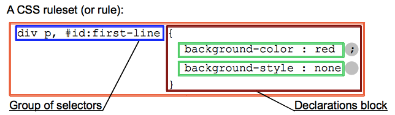

## 语法 ##
分两个部分：
+ 属性（ **property**）是一个标识符，用可读的名称来表示其特性
+ 值（**value**）则描述了浏览器引擎如何处理该特性。每个属性都包含一个有效值的集合，它有正式的语法和语义定义，被浏览器引擎实现。

### 声明 ###
+ 语法中的属性（**property**） + 值（**value**）就是一个声明
> `background-color: red`

### 声明快 ###
+ 声明加大括号组成声明块，可以嵌套
> `{background-color : red}`

### 规则集 ###
+ CSS可以在声明块前面放置选择器, 一个元素可以被放多个选择器， css标准会规定哪个优先级最高，这个叫（**层叠**）算法
> `span h1{background-color : red}`

### 语句类型 ###
+ 规则集（简称规则）
+ at规则（`@charset  @impor`）